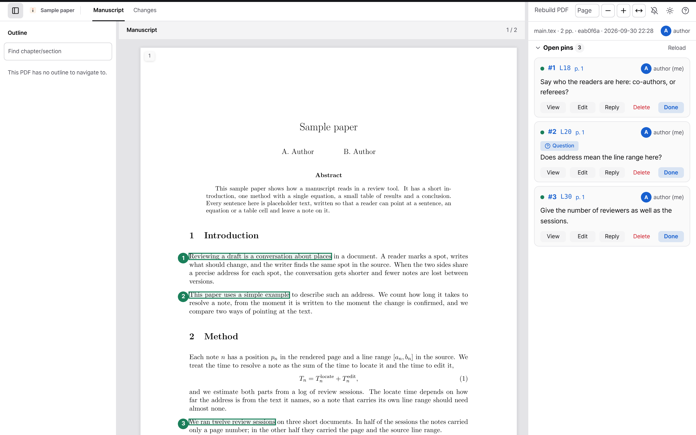

<h1 align="center">
  <picture>
    <source media="(prefers-color-scheme: dark)" srcset="docs/assets/brand/wordmark-dark.svg">
    
  </picture>
</h1>

<p align="center"><strong>Point at a spot in the PDF, reach the source line.</strong></p>

<p align="center">
  <a href="https://github.com/dartworklabs/limn/releases/latest"></a>
  <a href="LICENSE"></a>
  <a href="https://github.com/dartworklabs/limn/actions/workflows/ci.yml"></a>
</p>

<p align="center">English | <a href="README.ko.md">한국어</a></p>

<p align="center">
  <picture>
    <source media="(prefers-color-scheme: dark)" srcset="docs/assets/app-dark.png">
    
  </picture>
  <br>
  <sub>A sample paper in the viewer: three pins, each with the line it reaches in the source.</sub>
</p>

**Limn** (림, "to depict clearly") closes the revision loop between people and agents on a LaTeX
manuscript. Drag over a spot in the PDF, write what should change, and Limn turns it into a **pin**: the
`.tex` file and line range (recovered with SyncTeX, cross-checked against the text), plus your note.
Agents read the pins as a short work list (`pins.md`, ~35 tokens per pin instead of a 1,500-token
screenshot), edit the source, and close each pin with what they changed; a person confirms. Co-authors
on the same private network pin too, and every pin records who left it.

- Single stdlib-only Python server, browser viewer with vector PDF rendering (bundled PDF.js)
- Several documents per manuscript (manuscript, response letter, view-only reviewer PDFs, figure documents) as tabs
- Figure documents: a figure set drawn by code (one PDF page per figure plus a `limn-figure-map/1` element map) opens as a tab; a drag names the element and the script lines that drew it, and the pin's mark follows the element when the figure is rendered again
- Rebuilds on demand or when the upstream branch moves (`--git-pull`)
- Threads, questions, @mentions, assignees, review before done, a diff view per pin
- One [Reply] on a closed pin: a person's reply sends it back to the agent (a line under the box says so first; undo after sending), and a 30-day Trash for deleted pins
- One long-running **instance** per manuscript as a systemd user unit, exposed with `tailscale serve`

## Install

Requires Python ≥ 3.10, [uv](https://docs.astral.sh/uv/), a TeX distribution with SyncTeX
(`latexmk`/`pdflatex`) and Poppler (`pdftoppm`, `pdfinfo`).

```bash
uv tool install git+https://github.com/dartworklabs/limn@v0.4.22
limn version
```

With SSH access to GitHub, `git+ssh://git@github.com/dartworklabs/limn@v0.4.22` works too.

## Run one server

For one person reviewing on their own machine, use local authentication. The browser is the local owner and can
confirm an agent's completed work; agents connect with API tokens.

```bash
limn serve --manuscript ~/papers/paper2 --main main.tex --port 18300 --auth local
```

Open `http://127.0.0.1:18300/`. For collaboration on your tailnet, use the default tailscale authentication instead:

```bash
limn serve --manuscript ~/papers/paper2 --main main.tex --port 18300
# several documents as tabs:
limn serve --manuscript ~/papers/paper2 \
  --doc 'ms=Manuscript:manuscript/main.tex' --doc 'rr=Response:submission/review_response/review_response.tex'
```

It listens on `127.0.0.1` by default. Share the tailscale instance with
`tailscale serve --bg --https=18200 http://127.0.0.1:18300` and open its tailnet HTTPS address so the browser receives
your person identity. With default authentication, opening the loopback address without identity headers uses the
legacy local-agent identity and cannot confirm reviews. `limn serve --help` lists all options;
state (pins, builds) goes to `--state-dir` or `~/.local/share/limn/serve/<manuscript>-<hash>`.

Direct `limn serve --max-connections N` optionally caps each listener's admitted live TCP connections with a
positive integer N. It counts pending workers, active requests and idle keep-alive sockets until physical cleanup.
Excess sockets close before HTTP, without an HTTP error response. Omitting the option keeps the existing unlimited
admission and worker-start failure behavior.

When enabled, uncertain worker startup stops admission and exits nonzero after existing runtime cleanup; other
requests, daemon builds or comparisons may be interrupted. Watcher joins do not set a total exit deadline, and this
adds no drain, rollback or universal child cleanup. Operators choose activation and N later from their host limits,
legitimate demand, proxy behavior and rollback budget; removing the option restores unlimited admission. It does
not limit per-person work cost or provide complete DoS protection. See [operations](docs/handbook/operations.md#선택형-연결-입장-상한)
and [ADR-0016](docs/adr/0016-optional-connection-admission.md).

> **Security:** never expose Limn without an identity provider in front of it. The default (`--auth tailscale`)
> binds `127.0.0.1` and trusts the identity headers of `tailscale serve`; everyone on your tailnet who reaches
> the port is a collaborator unless you narrow it (`--members-only`, roles via `limn member`). `--auth local` is
> for one user on their own machine; `--auth trusted-proxy` is for running behind an authenticating reverse
> proxy, and is the only provider that may `--bind` a non-loopback address. Agents use API tokens
> (`limn token create`). Never a public URL without a proxy, never `tailscale funnel`. See [SECURITY.md](SECURITY.md).

## Instances (one per manuscript)

```bash
limn add paper2 --manuscript ~/papers/paper2 --git-pull   # ports, config, systemd unit limn@paper2, tailscale serve
         [--ui-lang <ko|en>]                               # the viewer's default language (a person's choice wins)
limn list                                                  # label, ports, state, open pins, documents
limn status paper2 · limn url paper2 · limn snippet paper2 # details · tailnet URL · block for AGENTS.md
limn update [--dry-run] [--ref vX.Y.Z]                     # reinstall via uv tool, restart running instances
limn stop paper2 · limn start paper2 · limn remove paper2
limn token create paper2 · limn member add paper2 <login> --role viewer   # agent token (shown once) · roles
limn token create paper2 --save                            # token file ~/.config/limn/paper2.token for agents on this machine
```

Config lives in `~/.config/limn/<name>.env`, state in `~/.local/share/limn/<name>` by default.
Details (Korean): [docs/handbook/instances.md](docs/handbook/instances.md).

## For agents

An agent reads `pins.md` (`curl -s <base>/pins.md`) or `GET /api/pins`, claims one pin right before
editing it, and closes it with a `reply` and a `ref` (commit/PR); a person confirms, or replies with what is
wrong, which reopens the pin into the open table. It authenticates with
a token from `limn token create <instance>` (`Authorization: Bearer …`); on the machine that serves the
instance, it reads the token from `~/.config/limn/<instance>.token` (`limn token create <instance> --save`). Agents never
confirm, and skip pins claimed by others, awaiting review, or assigned to a person. The full procedure
is [skill/SKILL.md](skill/SKILL.md); the API contract is [docs/handbook/api.md](docs/handbook/api.md) (Korean). The `pins.md` format and
the HTTP API are a stable contract — they do not change with the UI language.

## Documentation

| | |
|---|---|
| [skill/SKILL.md](skill/SKILL.md) | agent procedure (install it as a skill in your agent runtime) |
| [docs/handbook/](docs/handbook/index.md) | the System Handbook (Korean): purpose, architecture, pin domain, viewer, build and sync, HTTP API and `pins.md` format, operations, instances, verification, workflow, coding rules |
| [docs/adr/](docs/adr/) | architecture decision records |
| [SECURITY.md](SECURITY.md) · [CONTRIBUTING.md](CONTRIBUTING.md) · [CHANGELOG.md](CHANGELOG.md) | |

Access control design: [ADR-0002, access control, collaboration boundaries and sync](docs/adr/0002-access-control.md) (the v0.2 stage is implemented; later stages are proposed).

## License

Limn is licensed under AGPL-3.0-only. Commercial licenses are available from Dartwork (contact via GitHub issues for now).
Bundled third-party components: [THIRD_PARTY_NOTICES.md](THIRD_PARTY_NOTICES.md). Name and logo: [TRADEMARKS.md](TRADEMARKS.md).

## History

Limn started on 2026-09-21 as the `manuscript-pin-picker` skill of the writing-agent-playbook
repository (server `scripts/pin_server.py`), and its per-paper instance manager `bin/pin-viewer.sh`
(systemd units `pin-viewer@<name>`, from 2026-09-23) lived in a dotfiles repository. On 2026-09-25 both moved here with
their history (`git filter-repo`, merged with `--allow-unrelated-histories`) and were renamed Limn.
Personal data in the imported history was replaced with placeholders.

### Migrating from `pin-viewer@<name>`

Nothing is deleted; ports, tailnet addresses and pins carry over.

```bash
uv tool install git+https://github.com/dartworklabs/limn@v0.4.22
limn migrate --dry-run            # plan: ~/.config/pin-viewer/<name>.env -> ~/.config/limn/<name>.env
limn migrate                      # copy configs (idempotent; old files stay)
# per instance:
systemctl --user disable --now pin-viewer@<name>.service
limn start <name>                 # renders limn@.service, starts limn@<name>, waits for 200; serve entry unchanged
limn status <name>                # active, local 200, tailnet URL, same open-pin count
```

State directories stay where they are (the new config points at them). To also move state from
`~/.local/share/pin-viewer/<name>` to `~/.local/share/limn/<name>`, run
`limn migrate --move-state <name>` after stopping the old unit and before `limn start`. When every
instance runs as `limn@`, `~/.config/systemd/user/pin-viewer@.service`, `~/.config/pin-viewer/` and
the old `~/.local/bin/pin-viewer` can be removed.
